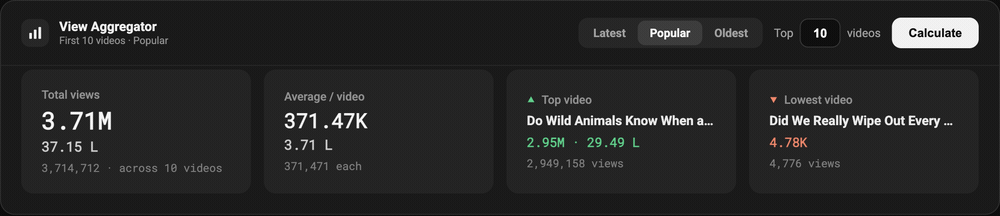

# YouTube Channel View Aggregator

Chrome extension. Adds an **in-page panel** on any channel page that aggregates **exact** view counts across the first N videos, and shows the **exact upload date** under each video.

## Features
- **In-page panel** injected above the video grid (vidIQ-style), theme-aware (dark/light auto).
- **Sort selector** — Latest / Popular / Oldest right in the panel; switches YouTube's tab, then aggregates that set.
- **All** — every video on the channel, not just the first N. Walks the whole Videos tab through YouTube's browse endpoint, so your scroll position never moves. ~16 s for a 445-video channel; re-running is much quicker because the per-video stats are cached (the listing walk itself repeats).
- **Videos vs Shorts** — `Videos | Shorts | Both`, using YouTube's own tab split rather than a duration guess (a 117-second Short and a 117-second video look identical by length). Every mode respects it.
- **Two channel ages** — how long the channel has existed (YouTube's created date) and how long it has actually been publishing (its first upload). A channel can sit dormant for years between the two.
- **Videos or months** — the counter takes either. `Top 10 videos` aggregates the first 10 of the active sort; switch the unit to **months** and `Last 3 months` aggregates everything published in that window, across the whole channel.
- **Total · Average · Per month · Median · Views by month** across five hairline-divided columns, then **Highest / Lowest** below them; mono tabular numerals on the figures only.
- **Readable numbers** — the rounded `2.9M` figure is the prominent one, with the Indian reading (`29.47 L`) and the exact count in the sub-line.
- **Exact upload date** injected under each video card as it scrolls into view (📅 Jul 22, 2026).
- **Auto-runs** on load; collapse with the header chevron; toolbar icon toggles the panel.

## Where the numbers come from
The videos grid only shows abbreviated views ("252K") and relative dates ("3 months ago"). For exact figures the extension asks YouTube's own player endpoint (`/youtubei/v1/player`, same-origin, no API key of your own needed) for each video's `viewCount` + `publishDate` — about 7 KB per video. If that ever stops answering it falls back to parsing the video's watch page.

## Install (Load unpacked)
1. Chrome → `chrome://extensions`
2. Toggle **Developer mode** (top-right) ON
3. Click **Load unpacked** → select this `youtube-view-aggregator` folder
4. (If updating) click **Reload** 🔄 on the extension card to pick up changes.

## Use
1. Open a channel's **Videos** tab (e.g. `youtube.com/@GardenWhispersUS/videos`).
2. The panel appears top-right. Pick **Latest / Popular / Oldest**, set N, click **Calculate**.
3. Total (both formats) + average + top/lowest show in the panel; each card gets its 📅 exact date.

## Notes
- Fetches stats 4 at a time; larger N = slower. 10–50 is snappy.
- The run that fires on page load never moves your scroll position, so it can only count the rows YouTube has rendered. If that's fewer than N it says so, and re-counts by itself once scrolling brings the rest in. Clicking **Calculate** loads the full N up front.
- Reads whatever sub-tab is active, so the Oldest/Popular/Latest choice is respected.
- Month windows and **All** re-walk the channel listing on every run; only the per-video stats are cached, so a repeat run is much faster but not instant.
- If YouTube hands back only part of a channel's list, "Publishing for" is shown as `≥ Ny Nm` with "oldest listed" instead of "first upload" — hover it for the count it actually saw.
- Videos + Shorts should reconcile with the channel's advertised count — Veritasium lists 445 + 77 = 522, and their combined views land within 0.03% of the lifetime figure on YouTube's About page. Live streams and deleted videos are the remaining gap.
- If YouTube changes its DOM, the selectors in `content.js` (`ytd-rich-item-renderer`, `.ytContentMetadataViewModelHost`, `chip-bar-view-model button[role="tab"]`) or the `viewCount`/`publishDate` regexes may need a tweak.
